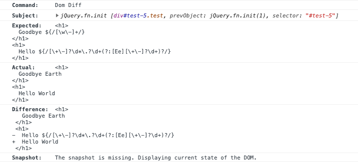

# cy-dom-diff

`cy-dom-diff` allows matching chunks of DOM against HTML; including dynamic content.

## Introduction

`cy-dom-diff` consist of two parts.  First is a Cypress command that matches a DOM element against a regular expression.  When a DOM element is matched its HTML is normalized to produce consistent diffable output while maintaining sematic meaning.  This includes:

* whitespace and newlines are normalized
* tags and attributes are printed on individual lines
* comments are removed
* tags and attributes can be ignored through configuration

In the second part `cy-dom-diff` provides a template function to generate a regular expression from a HTML string.  This HTML string is passed through the same normalization as the DOM element (described above) as well as allowing embedded regular expression for dynamic content.

## Installation and Setup

```sh
npm install --save-dev @swimlane/cy-dom-diff
```

Import the Cypress commands in `cypress/support/index.js` or `cypress/support/commands.js`

```js
import '@swimlane/cy-dom-diff/commands';
```

## Usage

In a basic example the following will assert that the element matches the regexp generated by the `dom` template tag.  Most of the HTML string within the tagged template string is treated literally.  However, regular expressions within the embedded expression are matches as expected.

```js
import { dom } from '@swimlane/cy-dom-diff';

const TIME = /\d?\d:\d?\d\:\d?\d/;
const NUMBER = /[\+\-]?\d*\.?\d+(?:[Ee][\+\-]?\d+)?/;

cy.get('#clock').domMatch(dom`
    <span>The current time is:</span>
    <span class="clock">${TIME} ${/[AP]/}M</span>
    <span class="offset">${NUMBER}</span> hrs
  `);
```

### `cy.domMatch` Cypress command

`cy.domMatch` will run the `domMatch` assertions (see below) and add a Cypress runner log with a diff.



### `cy.domDiff` Cypress command

`cy.domDiff` is used in the same way as `cy.domMatch` but will only add a Cypress runner log with a diff.  It will not fail if the DOM does not match and will not retry.

### `domMatch` Chai assertion

At its lowest level `cy-dom-diff` adds a Chai assertion for matching the DOM.  This will not generate a Cypress log except to show that the assertion passed or failed.  Use `cy.domMatch` to get better logging.

```js
import { dom } from '@swimlane/cy-dom-diff';

const TIME = /\d?\d:\d?\d\:\d?\d/;
const NUMBER = /[\+\-]?\d*\.?\d+(?:[Ee][\+\-]?\d+)?/;

cy.get('#clock').should('domMatch', dom`
  <span>The current time is:</span>
  <span class="clock">${TIME} ${/[AP]/}M</span>
  <span class="offset">${NUMBER}</span> hrs
`);

// OR

cy.get('#clock').then($el => {
  expect($el).to.domMatch(dom`
    <span>The current time is:</span>
    <span class="clock">${TIME} ${/[AP]/}M</span>
    <span class="offset">${NUMBER}</span> hrs
  `);
});
```

## Credits

`cy-dom-diff` is a Swimlane open-source project; we believe in giving back to the open-source community by sharing some of the projects we build for our application. Swimlane is an automated cyber security operations and incident response platform that enables cyber security teams to leverage threat intelligence, speed up incident response and automate security operations.